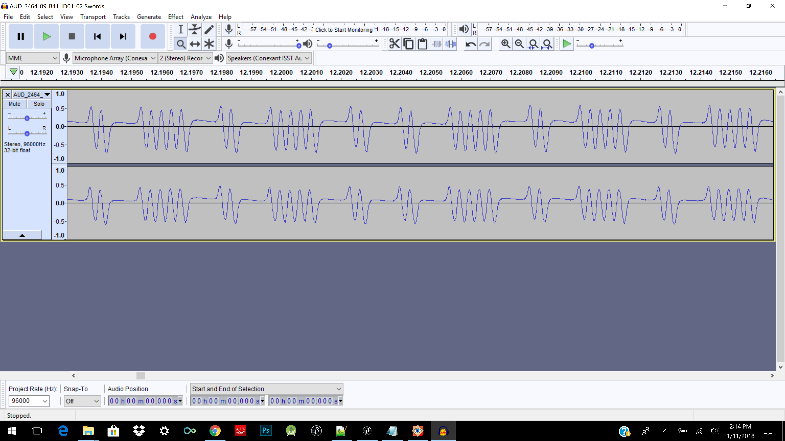

# Extract-WAV-Data
This code repository provides a procedure and tool for extracting RCA COSMAC (CDP1801 and CDP1802 microprocessor) byte data programs encoded in WAV files.
The WAV files are digital copies of cassette tapes made in 1974-1976 by Joe Weisbecker to store COSMAC programs for 
FRED (Flexible Recreational Educational Device), Arcade, and VIP computer systems.

The Hagley Museum and Library, Wilmington, Delware, digitized the cassette tape audio to create the WAV files from the Joe Weisbecker archive accession number 2464, box 9, B41. The WAV files were purchased from the Hagley Library.

The program tool processes input in the form of a single raw signed 8-bit PCM data file (no header) that contains one program.
The WAV file from the Hagley Library is a stereo audio file recorded at a sampling rate of 96000 Hz stored as 32 bit floating point samples. The file has two copies of byte coded programs on both left and right channels. The WAV file must first be 
converted into a raw file for input into the tool. This approach was done to simplify the programming effort needed to code the tool.

## Processing/Java
The program tool is written in the Processing/Java language and does not use any other libraries. 
You will need the Processing SDK to run the program tool.
You can download the Processing SDK from 

https://processing.org

## Audacity Sound Editor
To use the program tool, the WAV file must first be converted into a signed 8-bit PCM raw data file for one channel and one program.
I use the sound editor "Audacity" to isolate a single channel of WAV file audio 
representing one COSMAC program (not multiple copies in the WAV file)
and then export the isolated audio segment as a raw signed 8-bit PCM file.
The raw file does not have the WAV file header.

Audacity is available for download from

https://www.audacityteam.org/download/

## Data Tape Format
A data byte stored on the tape begins with a "1" start bit, followed by 8 data bits, and ends with an odd parity bit.
The data bits are ordered as least significant bit first.
A program is preceded by multiple 0 bits for synchronization, until the first start bit.

## RCA Coin Arcade Games and FRED Tape Encoding
The COSMAC FRED 2/Arcade Game tapes sound data use two cycles of 2000 HZ to represent a 0 bit, 
and five cycles of 2000 HZ to represent a 1 bit.
The program tool only works for this type of data for now.

## COSMAC VIP Tape Encoding
The COSMAC VIP program data tapes use one cycle of 2000 HZ to represent a 0 bit, and one cycle of 800 HZ to represent a 1 bit.

(Not implemented in the tool, the tool will need to be modified for VIP tape data)

## Example Data Waveform in Audacity Sound Editor

The above screenshot example waveform data is a "01010010101". In the waveform example the first "1" bit is a start bit, 
and is followed by 8 data bits, and the waveform ends with a "1" parity bit.
The data byte value is hexadecimal "52" (least significant bits first). This example assumes preceeding "0" bits before the first data byte.

## Using Audacity Video
Here is a link to video explaining how I used Audacity to help with the WAV data extraction process.
There are easier ways to use Audacity but the steps I talk about in the video get the job done.
I noticed some tapes only have 2047 bytes stored, so the 2048th byte is sometimes interpreted as garbage,
depending on how the trailing audio is trimmed.

https://youtu.be/AfX4LBK-_JA

## References
Written by Andy Modla
